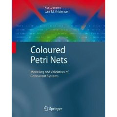
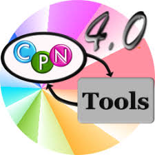

## Coloured Petri Nets: Modelling and Validation of Concurrent Systems

[Kurt Jensen](http://pure.au.dk/portal/en/persons/kurt-jensen(40695a62-b356-4d94-b437-4db0be203bdc.html) | [Lars Michael Kristensen](http://lmkr.org)
  -------------------|-----------------------
  Department of Computer Science | Department of Computing
  Aarhus University, Denmark | Western Norway University of Applied Sciences
Springer, July 2009 
Available via: <a href="http://www.springer.com/computer/foundations/book/978-3-642-00283-0">Springer</a> <a href="http://www.amazon.co.uk/Coloured-Petri-Nets-Kurt-Jensen/dp/3642002838/ref=sr_1_1?ie=UTF8&s=books&qid=1242997339&sr=8-1">amazon.co.uk</a> <a href="http://www.amazon.com/Coloured-Petri-Nets-Validation-Concurrent/dp/3642002838/ref=sr_1_2?ie=UTF8&s=books&qid=1242997480&sr=1-2">amazon.com</a> 

### Welcome to the homepage of the CPN Book

Coloured Petri Nets (CP-nets or CPNs) is a language for
modelling and validation of concurrent and distributed systems and
other systems in which concurrency, synchronisation, and communication
plays a major role. The CPN textbook introduces the constructs of the
CPN modelling language and explains how CPN models facilitate
simulation, state space analysis, behavioural visualisation, and
simulation-based performance analysis. It provides a comprehensive
road map to the practical use of CP-nets including a presentation of
selected industrial case studies illustrating the use of CPN modelling
and validation for design, specification, simulation, and verification
in a variety of application domains.

This website contains supplementary material for the textbook, including slides sets, CPN
models, and suggestions for exercises and projects.

- Selected chapters of the book are available for free
  - Preface
  - Table of Content
  - Chapter 1: Introduction
  - Chapter 2: Non-hierarchical CPNs
  - Chapter 15: Teaching CPNs

- CPN models for the individual chapters
- Slides for the individual chapters

The CPN modelling language is supported by the computer
tool [CPN Tools](http://www.daimi.au.dk/CPNTools)

CPN Tools is available free of charge.
